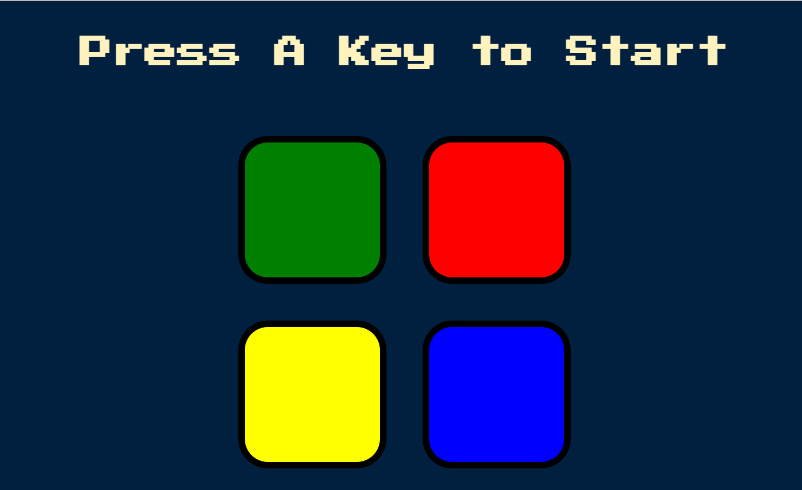

# Simon Game 🎮

A simple web-based version of the classic **Simon Game**, where players must memorize and repeat an ever-increasing sequence of colors.

## 📸 Preview

 

## ▶️ How to Play

1. Click the **A key** to begin.
2. A color will flash and play a sound — memorize it.
3. With each new round, **one new color is added to the end of the sequence**.
4. You must repeat the **entire sequence in order**, from the first color to the newest.
